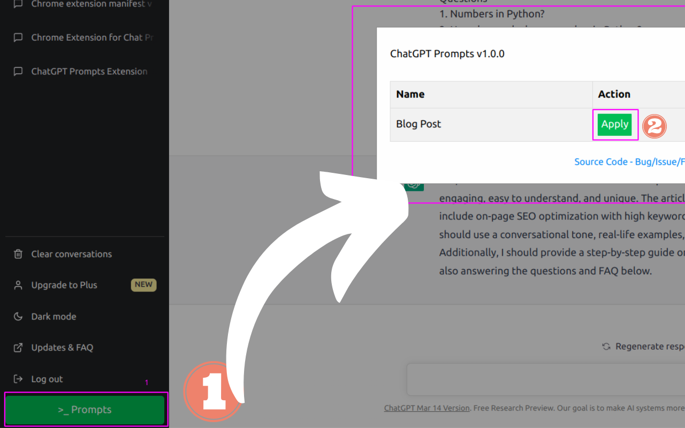

# ChatGPT Prompts Extension
The Custom Prompts Extension is a browser extension that allows you to manage prompts in your browser. With this extension, you can apply prompts to speed up your research.

## Features

- Prompt for content writing

## Installation
The Custom Prompts Extension can be installed from the Chrome Web Store or Mozilla Add-ons.

## Usage

- Once the extension is installed, you can access it by clicking on the green colored **>_ Prompt** button in the bottom left side.
- Click on the apply button to apply the prompt.
- Once you have applied, replace the specific section of prompts inside the double quotes and hit enter.

> Tip: Once ChatGPT responds with yes I understand, you can ask chatgpt "Can you write me an outline of the article with not more than 9 main headings?". And then ask it to write as per the outline.

## Contributing
Contributions to the Custom Prompts Extension are welcome! If you have a feature request or encounter a bug, please open an issue on the GitHub repository.

## License
The Custom Prompts Extension is licensed under the MIT License.